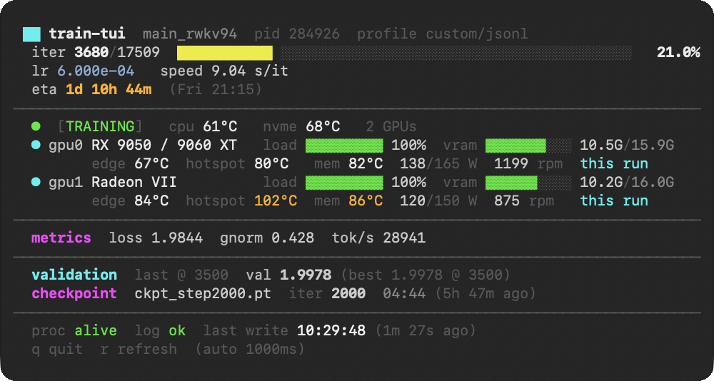

# train-tui

A small terminal dashboard for keeping an eye on a training run. It follows the run's log, reads every GPU and a few temperature sensors, and redraws once a second. One C file, no dependencies, and it never touches the run it is watching.



It started as a way to check on long HAT super-resolution runs on an AMD box without juggling `tail -f`, `sensors` and the sysfs files, and grew profiles for other kinds of logs along the way. There is a [simulated version in the browser](https://herrei.github.io/train-tui/) if you want to see it move.

## Install

```bash
git clone https://github.com/HerRei/train-tui.git
cd train-tui
make                 # builds ./train_tui
sudo make install    # optional: /usr/local/bin/train-tui
```

It needs Linux, because everything comes from `/proc` and `/sys`, and any C compiler. Prebuilt binaries for x86-64 and arm64 are on the [releases page](https://github.com/HerRei/train-tui/releases).

## Running it

Give it the project, the experiment name, the config and the PID of the training process:

```bash
train-tui -p basicsr ~/HAT HAT-L_SRx4_face options/train/train_HAT-L_SRx4_face.yml 3703603
```

Or let it look for the run itself. `-a` picks the first `python … train*.py` it finds:

```bash
train-tui -a
```

`q` quits, `r` redraws right away. The full list is in `train-tui -h`:

```
train-tui [options] project_root exp_name config_name pid [log_file]

  -a              auto-detect a running training process (scan /proc)
  -p <profile>    basicsr (default), lightning, hf or jsonl
  -c <file>       profile file (see sample.profile)
  -t <total>      total iterations (overrides config and log)
  -k <dir>        checkpoint directory (default: next to the log)
  -g <backend>    GPUs: auto (every card found), amd, nvidia, none
  -i <seconds>    refresh interval (default 1; raise it on a slow link)
  --once          print one frame and exit (no escape codes when piped)
```

Use `-` as the config if there isn't one.

## What you see

From the top:

- How far along the run is, with an ETA. The ETA is the log's own when it prints one; otherwise it is measured from how fast the steps arrive.
- One block per GPU, however many there are: load and VRAM, then edge, hotspot and memory temperature, power against the card's cap, fan, and who is using the card.
- CPU package and NVMe temperature in the status line.
- The latest losses, the last validation with the best value so far, and the newest checkpoint.

Temperatures stay white until they get within 15 °C of the critical limit the driver reports for that sensor, turn amber, and go red in the last 5 °C. NVIDIA doesn't report the limits, so cautious defaults stand in.

The state in brackets is `TRAINING`, `VALIDATING`, `SAVING`, `IDLE` (no log line for ten minutes and the GPUs quiet), `CRASHED` (the process is gone early) or `FINISHED` (it is gone after the last step).

## Logs it understands

| Profile | For | Where the total comes from |
|---------|-----|----------------------------|
| `basicsr` | BasicSR, Real-ESRGAN, HAT, SwinIR | `total_iter` in the YAML |
| `lightning` | PyTorch Lightning progress bars | `-t` |
| `hf` | Hugging Face Trainer | the `Total optimization steps = …` line |
| `jsonl` | one JSON object per line | a `"total_steps"` field |

If your training loop writes its own log, JSON lines are the easiest fit:

```python
log.write(json.dumps({"step": step, "loss": loss, "lr": lr, "time": time.time()}) + "\n")
```

```bash
train-tui -p jsonl . my_run - $PID runs/my_run/log.jsonl
```

It picks up `step`, `loss`, `lr`, `grad_norm` or `gnorm`, `epoch`, and `val_loss`, `val` or `eval_loss` for validation (lower is better). `total_steps` can be on any line, and `time` (Unix seconds) makes the ETA exact.

For anything else, write a profile: a short `key = value` file that says which words in your log mark the step, the losses and so on. [`sample.profile`](sample.profile) explains every key. A profile can start from a built-in one and change only what differs:

```
base = jsonl
ckpt_prefix = ckpt_step
ckpt_suffix = .pt
loss_fields = "loss":, "tok_s":
loss_labels = loss, tok/s
```

## GPUs

AMD cards are read straight from sysfs (`/sys/class/drm`), and their names come from the system's `pci.ids`. NVIDIA cards come from `nvidia-smi`. By default it shows every card it finds from both, so a single card, eight cards, or a mixed box all work. `-g amd`, `-g nvidia` or `-g none` narrows it down.

The end of each card's second line says who is on it:

- `this run`: a process from the run you are watching. That means the PID you gave and anything in its process group, so DDP ranks started by `torchrun` or by one script count.
- `+2`: two processes from other jobs share the card with your run.
- `other job`: something else is using it.
- `free`: nothing is.

On AMD this comes from `/sys/class/kfd`, on NVIDIA from `nvidia-smi --query-compute-apps`.

## Over SSH and Tailscale

It is an ordinary terminal program, so it runs anywhere SSH does. Ask SSH for a terminal with `-t`:

```bash
ssh -t gpu-box 'train-tui -a'
```

Over Tailscale it is the same command with the machine's tailnet name. If Tailscale on your laptop runs in userspace-networking mode, as the plain `tailscaled` on macOS does, ssh can't reach tailnet addresses by itself. Send it through Tailscale in `~/.ssh/config` instead:

```
Host gpu-box
    ProxyCommand tailscale nc %h %p
```

Add `--socket=…` after `tailscale` if your daemon doesn't listen on the default socket.

Some things that make remote use pleasant:

- Without `-t` you get one plain frame and a hint, not a screen full of escape codes. `ssh gpu-box 'train-tui --once -a'` is handy in scripts; set `COLUMNS` there to choose the width.
- A refresh is about 3 KB. On a slow or relayed connection, `-i 5` redraws every five seconds instead.
- Resizing the window redraws it cleanly, and arrow keys don't quit by accident.
- If the connection drops, train-tui exits and the run carries on. It only ever reads.

## What it touches

Nothing it doesn't need. It reads the log, the config, the GPU and temperature sensors, and the list of files in the checkpoint folder. It never writes anywhere, never opens anything for writing, and the only signal it sends is `kill(pid, 0)`, which just asks whether the process still exists. The log is read incrementally: the last 8 MiB when it starts, then only new lines.

## Tests

`make test` builds with warnings as errors and renders frames against fixture logs for every profile, a fake sysfs with one and with two AMD cards, and a stand-in `nvidia-smi`. CI runs it with gcc and clang on every push.

## License

MIT
